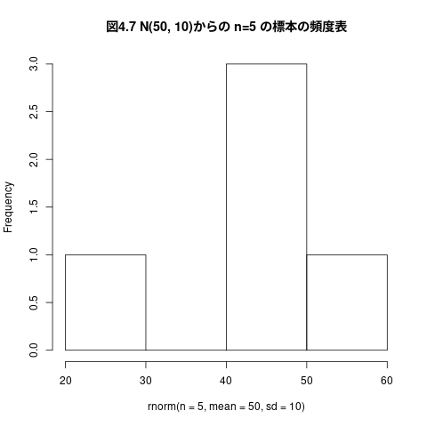
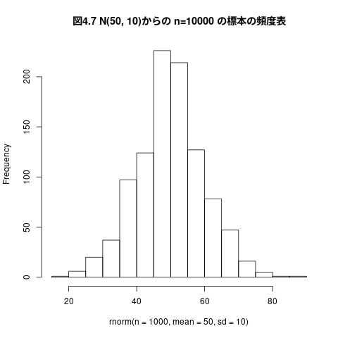
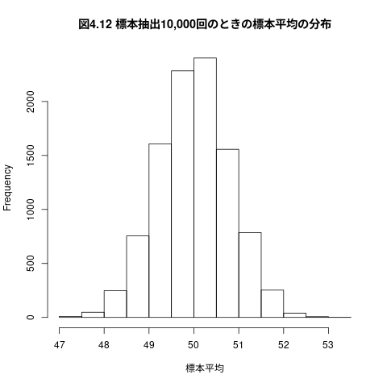
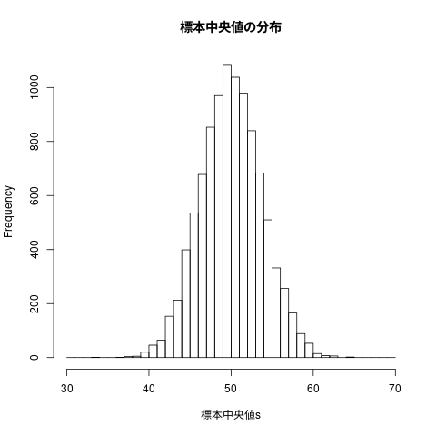

# Rによるやさしい統計学

    rm -f RforS-Codes/04-*.R

## 4章 母集団と標本

### 4.1 母集団と標本

重要な用語

-   **母集団:** 対象のデータ全体　　　　　　
-   **標本 :** 母集団から一部のデータを取り出した(抽出した)もの。
    標本数を標本の大きさという。
-   **標本抽出:** 母集団から一部のデータを取り出すこと
-   **母数 (パラメーター):** 母集団の性質をあらわす統計的指数（比率、平均、分散、相関係数など）

### 4.2 推測統計の分類

推測統計とは， **標本から母集団の性質を推し測ること**

#### 推定

##### 点推定

標本から母数の値を求める

##### 区間推定

標本から母数の値の範囲を求める

#### 検定

-   母集団について述べた二つの異なる主張(仮説)
-   どちらを採択するかを決める

### 4.3 点推定

#### 手順

1.  標本の抽出
    **標本のサイズ** $ n $
2.  標本を用いて，母平均の推定値を計算する

    #### 
    ## 標本
    身長 <- c(165.2, 175.9, 161.7, 174.2, 172.1, 163.3, 170.9, 170.6, 168.4, 171.3)
    
    ## 標本平均
    mean(身長)
    
    ## 標本不偏分散 (後出)
    var(身長)

    [1] 169.36
    [1] 21.66711

##### 意味

-   記述統計の文脈では，数値要約のための代表値を求める，こと
-   推測統計の文脈では，母平均の点推定を行う，こと

#### 推定量と推定値

-   **標本統計量:** 標本平均，標本分散，&#x2026;
-   **母集団の統計量:** 母平均，母分散，。。。

#### 標本抽出に伴なう誤差

[標本誤差とは｜市場調査ならインテージ](https://www.intage.co.jp/glossary/041/)

-   推定値と母数の誤差

### 4.4 推定値がどれくらいあてになるのかを調べる方法

rm -f RforS-Codes/04-04.R

#### 4.4.1 単純無作為抽出

標本抽出の方法としての単純無作為抽出

#### 4.4.2 確率変数

単純無作為抽出によって得られるデータの性質としての確率変数

#### 4.4.3 確率分布

確率変数がどのような値をとるのかを示す確率分布

##### 一様分布 (unif())

-   サイコロ振りの実験 $ n=6 $

    ##
    ## 一様分布に従う6個の標本の抽出
    (サイコロ6 <- ceiling(runif(n=6,min=0,max=6)))
    
    ## 頻度表の作成
    table(サイコロ6)

    [1] 4 4 3 4 1 6
    サイコロ6
    1 3 4 6 
    1 1 3 1 

-   サイコロ振りの実験 $ n=60000 $

    
    ## 一様分布に従う6000個の標本の抽出
    サイコロ60000 <- ceiling(runif(n=60000,min=0,max=6 )
    
    ## 頻度表の作成
    # table(サイコロ60000)

##### 4.4.4 母集団分布

確率分布を用いた母集団の表現としての母集団分布

-   (例) 男女比が 2:1 である母集団
    
        ##
        ## (例) 男女比が 2:1 である母集団
        
        barplot(c(2/3, 1/3), names.arg=c("男性", "女性"),
                xlab="性別", ylab="比率",
                main="図4.3 性別の母集団分布の例")
        box(lty=1)
    
    

###### 図4.3 性別の母集団分布の例

**無作為抽出の標本は，母集団分布に従う**

##### 4.4.5. 代表的な母集団分布である正規分布

    ##
    ## 正規分布のグラフを描く
    
    ## png("graphs/norm_graphs.png",width=400,height=300) 出力を PNG形式のファイルへ
    
    curve(dnorm(x), from=-4, to=4, main="図4.4-5 正規分布 N(0, 1), N(0,2), N(1,1)")        # 標準正規分布のグラフ， -4 から +4 の範囲
    curve(dnorm(x,sd=2), add=TRUE)        # 平均0， 偏差2 の正規分布，上描き 
    curve(dnorm(x,mean=1,sd=1), add=TRUE) # 平均1， 偏差1 の正規分布，上描き 

###### 図4.4-4.5 正規分布 N(0,1), N(0,2), N(1,1)

#### 4.4.7 正規母集団から単純無作為抽出を行なう

**Rを使って正規分布の母集団から標本を抽出する方法**

例えば、平均50、標準偏差10の正規母集団からn＝5の標本を無作為抽出
する

    ##
    ## 平均50、標準偏差10の正規母集団からn＝5の標本を無作為抽出する
    #### png("graphs/fig-04-07.png", width=400,height=300)
    
    rnorm(n=5, mean=50, sd=10)       # 標本の抽出
    hist(rnorm(n=5, mean=50, sd=10), main="図4.7 N(50, 10)からの n=5 の標本の頻度表") # 頻度表の描画

###### 図 4.7 N(50,10)からの n=5 の標本の頻度表

    ##
    ## 平均50、標準偏差10の正規母集団からn＝1000の標本を無作為抽出する
    
    #### png("graphs/fig-04-08.png", width=400,height=300)
    hist(rnorm(n=1000, mean=50, sd=10), main="図4.8 N(50, 10)からの n=1000 の標本の頻度表")

###### 図 4.8 N(50,10)からの n=1000 の標本の頻度表

### 4.5 標本分布

rm -f RforS-Codes/04-05.R

-   **標本分布:** 標本統計量の確率分布のこと
    -   推定値の信頼性の判断に用いる
    
    -   標本における個々のデータの実現値を表した度数分布ではなく、
    
    -   標本統計量の確率分布である

#### 4.5.1 標本分布から何が分るのか

-   図4.9 標本分布の中心は、ほぼ「母数の本当の値」の
    ところに来ている

-   図4.10 標本分布の中心は、「母数の本当の値」からずれている

-   図4.11
    -   標本分布の中心は、ほぼ「母数の本当の値」のところに来てい
        るが，
    -   当たり外れが大きくて、推定値はあまりあてになるとはいえなそう

標本分布を調べるときの観点候補:

（1）標本分布が母数の本当の値を中心として分布しているか
（2）標本分布が横に大きく広がっていないか

#### 4.5.2 標本分布を経験的に求める

標本分布は次のものから数学的に求まる:

1.  母集団分布
2.  標本統計量の計算式 (変数変換)
3.  標本数

Rを用いて，理論的ではなく，経験的の標本分布を求めることができる

標本統計量の実現値を大量に得られれば，そのヒストグラムは，標本分
布近いものとなるはず。

-   サイズ $ n $ の標本を何度も繰かえし抽出し，実現量を計算し，ヒス
    トグラムを作成する

しかし，母集団分布が母数を含めてわかっていないため，

-   「もし母集団分布がこのような正規分布だったら、

-   このくらいあてになる推定値が得られる」

ということを検討することになる。

#### 4.5.3 正規母集団の母平均の推定

-   母集団分布 $ \sim N(50, 10^2)$
-   $ n = 10 $
-   母平均の推定量は，標本平均 $ \overline{X} $

    ##
    ## 標本サイズ10の標本による，母平均の推定
    
    標本 <- rnorm(n=10, mean=50, sd=10)
    mean(標本)

    44.9971134002593

#### 4.5.4 標本分布を求める

母平均の推定を10000回繰り返し

    ##
    ## 母平均の推定
    ### 母集団 N(50, 10^2) から
    ### 標本サイズ 10の標本の標本平均
    ### 10000個の標本平均の頻度表を描く
    this.mean <- 50
    this.sd <- 10
    this.counts <- 10000
    
    for (this.sample_size in c(10,20,40,80,160)) {
      標本平均 <- numeric(length=this.counts) 
          
      for(i in 1:this.counts) {
    1
        標本 <- rnorm(n=this.sample_size, mean=this.mean, sd=this.sd)
        標本平均[i] <- mean(標本)
      }
      cat("sample_size=", this.sample_size,
          "mean=", mean(標本平均),
          "var=", var(標本平均),
          "\n")
    }

    sample_size= 10 mean= 50.00768 var= 9.70614 
    sample_size= 20 mean= 49.97293 var= 4.901012 
    sample_size= 40 mean= 49.97277 var= 2.490787 
    sample_size= 80 mean= 49.99391 var= 1.249024 
    sample_size= 160 mean= 50.00111 var= 0.6388567

    
    hist(標本平均,main="図4.12 標本抽出10,000回のときの標本平均の分布")

##### 図4.12 標本抽出10,000回のときの標本平均の分布

母平均 (50)からのズレが5以内か否かで振り分ける

    
    ## 母平均 (50)からのズレが5以内か否かで振り分ける
    
    誤差絶対値5以下 <- ifelse( abs(標本平均-50) <= 5, 1, 0)
    table(誤差絶対値5以下)

<table border="2" cellspacing="0" cellpadding="6" rules="groups" frame="hsides">

<colgroup>
<col  class="org-right" />

<col  class="org-right" />
</colgroup>
<tbody>
<tr>
<td class="org-right">0</td>
<td class="org-right">1190</td>
</tr>

<tr>
<td class="org-right">1</td>
<td class="org-right">8810</td>
</tr>
</tbody>
</table>

**88%くらいは，母平均+-5に収まっている**

-   (n &rarr; inf) で $ E(\overline{X}) = $母平均

    ##
    ## 10000個の標本平均の平均値
    
    mean(標本平均)
    
    ## 10000個の標本平均の分散値
    
    var(標本平均)

    [1] 50.00111
    [1] 0.6388567

    ##
    # png("graphs/fig-04-13.png", width=400, height=300)
    ##
    hist(標本平均,freq=FALSE, main="図4.13 標本平均の標本分布")
    curve(dnorm(x, mean=this.mean, sd=this.sd/sqrt(this.sample_size)), add=TRUE, col="red")

###### 図4.13 標本平均の標本分布

#### 4.5.5 不偏性

推定値 (e.g. 標本平均) の平均 (e.g. 標本分布の平均) は
母集団分布によらず，
母数 (e.g. 母平均) に一致すること

標本平均は，母平均の不偏推定量である。

#### 4.5.6 標準誤差

推定量の標本分布を調べるときの2つの観点のうち「（2）標本分布が横
に大きく広がっていないか」にかかわるのが標準誤差です。

標準誤差は、推定量の標本分布の標準偏差と定義する

標準誤差が小さいということ

-   運不運によって結果が大きく左右されない
-   また、誰がいつやってもだいたい同じ結果が安定
    して得られる

上の $ N(50,10^2) $の正規母集団から $ n=10 $ の標本を抽出した
ときの標本平均の例では、

-   標本平均の標本分布はN(50,10)だったので，
-   標準誤差は $ \sqrt{10} $ となります。

一般的に、

-   母集団が，平均 $ \mu $、分散$ \sigma^2 $ の正規分布で
-   標本サイズ $ n $ の標本を抽出したとき、
-   その標本平均の標本分布は $ N(\mu, \frac{\sigma^2}{n}) $となる
-   標準誤差は $ \frac{\sigma}{\sqrt{n}} $ となる。

このことから、

1.  母集団分布の分散（標準偏差）が大きいほど、標本平均の標準誤差が
    大きくなる。つまり、母分散が大きいと、そこから無作為抽出した標
    本の平均値は母平均から外れた値をとりやすくなる。

2.  標本サイズが大きいほど、標本平均の標準誤差が小さくなる。つ
    まり、標本サイズを大きくすれば、そこから無作為抽出した標本
    の平均値は母平均に近い値をとりやすくなる

実際に、先ほどの$ N(50,10^2) $ という母集団からの標本抽出の例で、標本サ
イズを10倍の $ n=100 $ にしてみると

    
    this.sample_size <- 100
    標本平均 <- numeric(length=this.counts)
          
    for(i in 1:this.counts) {
      標本 <- rnorm(n=this.sample_size, mean=this.mean, sd=this.sd)
      標本平均[i] <- mean(標本)
    }
    
    mean(標本平均) ## 付加
    var(標本平均)
    
    誤差絶対値5以下 <- ifelse( abs(標本平均-50) <= 5, 1, 0) ## 付加
    table(誤差絶対値5以下) ## 付加

    [1] 50.01269
    [1] 1.010955
    誤差絶対値5以下
        1 
    10000

    ##
    ## png(RforS-graphs/04-14.png)
    
    hist(標本平均,freq=FALSE, main="図4.14 標本サイズを大きくしたときの標本平均の標本分布")
    curve(dnorm(x,mean=50,sd=this.sd/sqrt(this.sample_size)),col="red",add=TRUE)
    curve(dnorm(x,mean=50,sd=this.sd/sqrt(10)),col="blue",add=TRUE)

##### 図4.14 標本サイズを大きくしたときの標本平均の標本分布

### 4.6 標本平均以外の標本分布

あらゆる標本統計量に対して標本分布を考えることができる。

#### 標本分散と不偏分散の標本分布

-   不偏分散は，母分散の不偏推定量
-   標本分散は，標本の散布度

    ##
    ## 4.6 標本平均以外の標本分布
    ##
    
    samples.no <- 10000   # いくつ標本を用いるか
    sample.size <- 10     # ひとつの標本の中のデータの個数
    
    this.mean <- 50       # 分布の平均
    this.sd <- 10         # 分布の標準偏差
    
    標本分散s <- numeric(samples.no) # 各々の標本の分散値の保存場所
    不偏分散s <- numeric(samples.no) # 各々の標本の不偏分散値の保存場所
    
    for (i in 1:samples.no) {
      標本 <- rnorm(n=sample.size, mean=this.mean, sd=this.sd) # ひとつの標本の生成
      標本分散s[i] <- mean((標本-mean(標本))^2) 
      不偏分散s[i] <- var(標本)
    }
    
    c(mean(標本分散s),sd(標本分散s))  # 標本分散達の平均と分散
    c(mean(不偏分散s),sd(不偏分散s))  # 標本不偏分散達の平均と分散

    [1] 90.10345 42.49519
    [1] 100.11495  47.21688

    
    標本分散誤差100以上 <- ifelse(標本分散s>=100,1,0)
    不偏分散誤差100以上 <- ifelse(不偏分散s>=100,1,0)
    table(標本分散誤差100以上)
    table(不偏分散誤差100以上)

    標本分散誤差100以上
       0    1 
    6512 3488
    不偏分散誤差100以上
       0    1 
    5585 4415

    ##
    ## 標本分散の頻度表
    ##
    hist(標本分散s, breaks=seq(0,500,10), main="標本分散の分布")

    ##
    ## 標本不偏分散の頻度表
    ##
    hist(不偏分散s, breaks=seq(0,500,10), main="不偏分散の分布")

##### 図4.15 標本分散と不偏分散の分布

 

    ##
    ## 標本分散の頻度表
    ##
    hist(標本分散s/100*10, freq=FALSE, breaks=seq(0,50,1), main="標本分散/母分散の分布と自由度9のカイ二乗分布")
    curve(dchisq(x,9), add=TRUE, col="red")

    ##
    ## 標本不偏分散の頻度表
    ##
    hist((不偏分散s/100)*9, freq=FALSE, breaks=seq(0,50,1), main="不偏分散/母分散の分布と自由度9のカイ二乗分布")
    curve(dchisq(x,9), add=TRUE, col="red")

 

 

#### 4.6.2 中央値の標本分布

母平均の推定量として，標本平均よりよい標本統計量はないのか？

-   **よい推定量:** 標本誤差の小さい推定値が得られやすい

中央値を母平均の推定量として使えるか

    ##
    ## 4.6.2 中央値を母平均の推定量として使えるか
    ##
    samples.no <- 10000
    sample.size <- 10
    this.mean <- 50
    this.sd <- 10
    
    標本平均s <- numeric(samples.no)
    標本中央値s <- numeric(samples.no)
    
    for (i in 1:samples.no) {
      標本 <- rnorm(n=sample.size,mean=this.mean,sd=this.sd)
      標本平均s[i] <- mean(標本)
      標本中央値s[i] <- median(標本)
    }
    
    c(mean(標本平均s), sd(標本平均s))
    c(mean(標本中央値s), sd(標本中央値s))

    [1] 50.002369  3.183515
    [1] 50.012799  3.748797

    ##
    ## 標本分散の頻度表
    ##
    hist(標本平均s, breaks=seq(30,70,1), main="標本平均の分布")

    ##
    ## 標本中央値の頻度表
    ##
    hist(標本中央値s, breaks=seq(30,70,1), main="標本中央値の分布")

          

