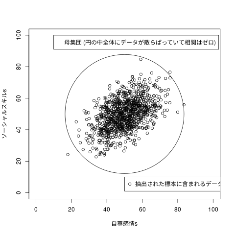
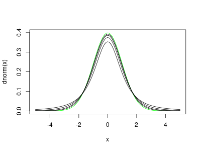
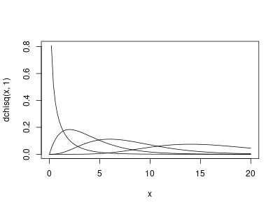

---
output:
  pdf_document: default
  html_document: default
---
統計的仮説検定は、推測統計の中でも利用頻度の高い重要なもの。

以後，代表的な統計的仮説検定の方法について説明する:

-   統計的仮説検定の手順と様々な用語の説明
-   標準正規分布を使った検定、
-   t分布を使った検定、
-   無相関検定、
-   カイ二乗検定

# 5.1 統計的仮説検定の必要性

-   「日本人大学生の自尊感情とソーシャルスキルの間に相関関係がある」と主張
    するために，

-   50人の無作為標本から相関係数を推測し，0.5 であった。そこから，「自尊
    感情とソーシャルスキルの間に相関関係がある」と結論した。

-   反論: 母集団には相関関係がないのに，相関関係が見られる標本を抽出した
    だけでは？

-   母集団全てを調べることなく，反論するには，
    
    無相関の母集団からの無作為標本に相関関係が見られる確率が非常に少ない
    ことを示す。

言い代えると：

-   母集団の全データを調べることなく，

-   標本統計量だけを用いて計算し，

-   仮説が現実的に起こる確率が非常に低いことを示すことで，

-   仮説を棄却する

# 教科書の図5.1 母集団と標本

[社会統計演習](http://www.cc.aoyama.ac.jp/~t41338/lecture/aoyama/stat2e/stat2e_top.html) 5.1の補足説明スライドに詳しい解説があります。

    #
    # 図5.1 母集団と標本
    #
    sample.size <- 1000
    A <- rnorm(sample.size)
    B <- rnorm(sample.size)
    C <- A*0.5 + sqrt(0.75)*B
    自尊感情s <- 10*A + 50
    ソーシャルスキルs <- 10*C + 50
    
    plot(自尊感情s, ソーシャルスキルs,
         xlim=c(0,100), ylim=c(0,100))
    points(50, 50, cex=45) # 母集団を囲む円
    legend(50, 10, legend="抽出された標本に含まれるデータ",pch=1)
    legend(10, 100, legend="母集団 (円の中全体にデータが散らばっていて相関はゼロ)")

標準正規分布からの二つの独立な標本，$\vec{A}$, $ \vec{B} $ から$
\vec{C} = 1/2 \vec{A} + \sqrt{3} / 2 \vec{B} $を作り，$\vec{A}$ と
$ \vec{C} $ をそれぞれ10倍し50足したものを，自尊感情とソーシャルスキ
ルにする。

    
    A %*% A /sample.size
    A %*% B /sample.size
    
    A%*%A
    sum(A^2)
    cor(A,B)
    cor(A-mean(A), B-mean(B))
    cor(A,C)
    cor(B,C)
    cor(自尊感情s, ソーシャルスキルs)

             [,1]
    [1,] 1.011991
                [,1]
    [1,] -0.01862613
             [,1]
    [1,] 1011.991
    [1] 1011.991
    [1] -0.01823838
    [1] -0.01823838
    [1] 0.4850767
    [1] 0.8654792
    [1] 0.4850767

無相関は直交

# 5.2　統計的仮説検定の手順と用語

-   母集団に関する帰無仮説と対立仮説を設定する
-   検定統計量を選ぶ
-   有意水準 $ \alpha $ を決める
-   検定統計量の実現値を求める
-   帰無仮説の棄却，対立仮説の採択

## 5.2.1 帰無仮説と対立仮説

-   **帰無仮説:** 提案する手法が従来の手法と「差がない」、 提案する手法は
    「効果がない」という仮説&#x2014;本来主張したいこととは逆の仮説。 この仮説
    が棄却されることを目標として仮説検定を行う。
    
    具体的には、母平均μ=0 (母平均は0である), 母相関係数 ρ=0 (相関がな
    い), 母平均の差μ1 - μ2= 0 (差がない)というような仮説

-   **対立仮説:** 帰無仮説が棄却されたときに採択される仮説
    
    帰無仮説とは逆の仮説であり、実験などで示したい・主張したいことを表し
    たもの
    
    具体的には、母平均μ≠0 (母平均は0でない), 母相関係数 ρ≠0 (相関が
    ある), 母平均の差μ1 - μ2≠ 0 (差がある)というような仮説

対立仮説の設定により、検定は次のどちらかで行う (両側検定の方がより厳し
い条件であり、普通は両側検定で行う):

-   片側検定：対立仮説が、母平均μ > 0 (もしくはμ < 0 )、 、母相関
    係数　ρ > 0 (もしくはρ < 0 )、、母平均の差μ1 > μ2 (もしくは
    μ1 < μ2 )、の場合

-   両側検定：対立仮説が、母平均μ≠0、母相関係数ρ≠0 、母平均の差
    μ1 - μ2≠ 0の場合
    
    両側検定では、例えば母平均μ≠0を調べるには、母平均μ > 0 とμ <
    0 の両方を調べなければならない

帰無仮説が正しいものとして分析を行う。 実際に得られたデータから計算さ
れた検定統計量の値によって採択を判断する。

帰無仮説が正しいとしたとき、検定統計量が、ほぼ起こり得ない値(それほど
極端な値)であれば、帰無仮説を棄却する(つまり、本来の主張を表す対立仮説
が採択される)。

そうでなければ, つまり，確率的に十分起こりうるような値であれば、
帰無仮説を採択する.
この場合は、本来主張したかった対立仮説が棄却されてしまう。

## 5.2.2 検定統計量

-   **検定統計量:** 統計的仮説検定のために用いられる標本統計量のこと。
    代表的な検定統計量の例: t, χ2、F

-   **検定統計量の実現値:** 実際のデータ（手に入った標本）を基に計算し
    てえられる具体的な値のこと
    
    検定統計量の実現値は、対立仮説に合うほど 0から離れた値を示す

## 5.2.3 有意水準と棄却域

-   **有意水準 $ \alpha $:** 対立仮説を採択するか決定するときの基準。
    
    有意水準は5％または1％(α=0.05またはα=0.01)に設定することが多い(つ
    まり、標本が100回に5回(5%の場合)以下にしか現れないデータであった&#x2014;
    こんなことは偶然では起こりえない&#x2014;、だから帰無仮説が成り立たないと
    考えて良いのではないか、という判断基準)

-   **帰無分布:** 帰無仮説が正しいものとして考えた時の標本分布
    
    -帰無分布に基づいて確率計算される

-   **棄却域:** 帰無仮説のもとで、非常に生じにくい検定統計量の値の範囲
    
    帰無仮説が棄却される領域(だから、この範囲に入るのが『望ましい』)
    
    棄却域に検定統計量の実現値が入ったら、帰無仮説を棄却する. 
    
    -   本来主張したかったことが採択される \*

-   **採択域:** 棄却域以外の部分&#x2014;「帰無仮説が採択される領域」
-   **臨界値:** 棄却域と採択域の境目の値

## 5.2.4 統計的仮説検定の結果の報告

検定統計量の実現値が棄却域に入った場合、「差がない」という帰無仮説を棄
却し、「差がある」という対立仮説を採択する。

「検定結果は5% (または1%)水準で有意である」または 「p < .05 (または p
 < .01 )で有意差が見られた 」 と記述する。

帰無仮説が棄却できない場合は、「検定の結果、差が有意でなかった」または
「有意差が認められなかった」と書く。

## 5.2.5 p 値

帰無分布で，検定統計量の実現値以上の領域が起る確率。

p値が有意水準より小さいとき帰無仮説を棄却する。

## 5.2.6 第1 種の誤りと第2 種の誤り

-   第1種の誤り $ \alpha $:: 「帰無仮説が真のとき，帰無仮説を棄却していまう」誤り
    のこと

-   第2種の誤り $ \beta $:: 「帰無仮説が偽のとき，帰無仮説を採択していまう」誤りのこと

## 5.2.7 検定力

-   **検定力:** 帰無仮説が偽の場合、全体の確率1から第2種の誤りの確率(1 - β)を引いた確率

「第2種の誤りを犯さない確率」とも、つまり間違っている帰無仮説を正しく棄却できる確率のこと　

## 「有意差がない」ということ

「実験や調査で得られた「条件間の差」は，標本抽出による誤差によって，十
分起り得る差です」ということ。
「統計的に意味のある差ではない」ということ。

有意差がみられなかったとしても，「同じである」ということではない。

# 5.3 標準正規分布を用いた検定（1 つの平均値の検定・母分散σ2 が既知）

-   $ N(\mu, \sigma^2) $ からの標本による標本の
-   標本平均の標本分布は，$ \bar{X} \sim N(\mu, \frac{\sigma^2}{n})$
-   標準化  $ Z = \frac{\bar(X) -\mu} {\sigma \sqrt{n}} $

## 標本

[社会統計演習](http://www.cc.aoyama.ac.jp/~t41338/lecture/aoyama/stat2e/stat2e_top.html)からshidouhouU8.csv をダウンロードしてください。

    
    指導法データ <- read.csv("RforS/data/shidouhouU8.csv")
    (心理学テスト <- 指導法データ$psych_test)

    [1] 13 14  7 12 10  6  8 15  4 14  9  6 10 12  5 12  8  8 12 15

## 統計検定量の選択

母集団が N(12, 10)なので

    
    this.mean <- 12
    this.sd <- sqrt(10)
    
    norm_stat <- function (X) {
      (mean(X)-this.mean) / (this.sd/sqrt(length(X)))
    }

## 帰無仮説と対立仮説の設定

-   **帰無仮説:** $ \mu = 12$
-   **対立仮説:** $ \mu \neq 12 $

## 有意水準の決定

    
    this.alpha <- 0.05

## 検定統計量の実現値を求める

    (z <- norm_stat(心理学テスト))

    mean(X) でエラー:  オブジェクト '心理学テスト' がありません

## 帰無仮説の棄却 or 採択の決定

    
    if ( pnorm(z)*2 > this.alpha ) {  print("mu==12")  } else {   print("mu/=12") }

    [1] "mu/=12"

## 棄却域の描画

    png("graphs/fig-05-02.png", width=400, height=300)
    curve(dnorm(x), -3, 3)
    z.lower <- qnorm(this.alpha/2)
    z.upper <- qnorm(1-this.alpha/2)
    abline(v=z.lower)
    abline(v=z.upper)
    curve(x-x-0.01, xlim=c(-3,z.lower), col='green',lwd=10,add=TRUE)
    curve(x-x-0.01, xlim=c(z.upper,3), col='green',lwd=10,add=TRUE)
    dev.off()

     qnorm(this.alpha/2) でエラー:  オブジェクト 'this.alpha' がありません
     qnorm(1 - this.alpha/2) でエラー: 
       オブジェクト 'this.alpha' がありません
     int_abline(a = a, b = b, h = h, v = v, untf = untf, ...) でエラー: 
       オブジェクト 'z.lower' がありません
     int_abline(a = a, b = b, h = h, v = v, untf = untf, ...) でエラー: 
       オブジェクト 'z.upper' がありません
     curve(x - x - 0.01, xlim = c(-3, z.lower), col = "green", lwd = 10,  でエラー: 
       オブジェクト 'z.lower' がありません
     curve(x - x - 0.01, xlim = c(z.upper, 3), col = "green", lwd = 10,  でエラー: 
       オブジェクト 'z.upper' がありません
    null device 
              1

# 5.4 t 分布を用いた検定（1 つの平均値の検定・母分散σ2 が未知）

-   分散未知の $ N(\mu, \sigma^2) $ からの標本，
-   標本平均の標本分布は，$ \bar{X} \sim N(\mu, \frac{\sigma^2}{n})$
-   スチューデント化  $ t = \frac{\bar(X) -\mu} {\Hat{\sigma}
          \sqrt{n}} $,
    $ \Hat{\sigma} $は，不偏分散の正の平方根

## t-分布

-   自由度1，2，4，8，16 の t-分布のグラフ
-   標準正規分布のグラフ (緑)

    
    dev.new()

    
    png("graphs/fig-05-03.png", width=400, height=300)
    curve(dnorm(x), -5, 5, col="green")
    for(i in 1:4) {
      curve(dt(x,2^i), -5, 5, add=TRUE)  
    }
    fig <- recordPlot()
    fig
    dev.off()
    dev.new()
    replayPlot(fig)

    null device 
              1

## 標本

    
    指導法データ <- read.csv("data/shidouhouU8.csv")
    (心理学テスト <- 指導法データ$psych_test)

    [1] 13 14  7 12 10  6  8 15  4 14  9  6 10 12  5 12  8  8 12 15

## 帰無仮説と対立仮説の設定

-   **帰無仮説:** $ \mu = 12$
-   **対立仮説:** $ \mu \neq 12 $

## 統計検定量の選択

母分散が未知なので，標本不偏分散を用いる。

    
    t_stat <- function (X) {
      (mean(X)-this.mean) / sqrt(var(X)/length(X))
    }

## 有意水準の決定

    this.mean <-12
    this.alpha <- 0.05

## 検定統計量の実現値を求める

    (t <- t_stat(心理学テスト))

    [1] -2.616648

## 帰無仮説の棄却 or 採択の決定

    
    if ( pt(t,19)*2 > this.alpha ) {  print("mu==12")  } else {   print("mu/=12") }

    [1] "mu/=12"

## 棄却域の描画

    dev.off()
    # png("graphs/fig-05-02.png", width=400, height=300)
    curve(dt(x,19), -3, 3)
    t.lower <- qt(this.alpha/2,19)
    t.upper <- qt(1-this.alpha/2,19)
    abline(v=t.lower)
    abline(v=t.upper)
    curve(x-x-0.01, xlim=c(-3,t.lower), col='green',lwd=20,add=TRUE)
    curve(x-x-0.01, xlim=c(t.upper,3), col='green',lwd=20,add=TRUE)
    # dev.off()

    null device 
              1

## t-test

    
    t.test(心理学テスト, mu=12)

    
    	One Sample t-test
    
    data:  心理学テスト
    t = -2.6166, df = 19, p-value = 0.01697
    alternative hypothesis: true mean is not equal to 12
    95 percent confidence interval:
      8.400225 11.599775
    sample estimates:
    mean of x 
           10

    
    t.test(心理学テスト, mu=11)

    
    	One Sample t-test
    
    data:  心理学テスト
    t = -1.3083, df = 19, p-value = 0.2064
    alternative hypothesis: true mean is not equal to 11
    95 percent confidence interval:
      8.400225 11.599775
    sample estimates:
    mean of x 
           10

# 5.5 相関係数の検定 (無相関検定)

帰無仮説として，「母集団において相関が0である」と設定

-   母集団相関係数 (母相関)に関する検定を行なうとき
-   標本相関係数の変換
    
    $$
          t = \frac {r \sqrt(n-2)} {\sqrt( 1-r^2 )}
          $$

-   すると，t は自由度 n-2 の t-分布にしたがう

## 例題

指導法データについて，統計テスト1と統計テスト2の得点の相関係数の
検定を行ってください。

有意水準5%の両側検定とします。

### 標本

    
    指導法データ <- read.csv("data/shidouhouU8.csv")
    (統計テスト1 <- 指導法データ$stat_test1)
    (統計テスト2 <- 指導法データ$stat_test2)

    [1]  6 10  6 10  5  3  5  9  3  3 11  6 11  9  7  5  8  7  7  9
    [1] 10 13  8 15  8  6  9 10  7  3 18 14 18 11 12  5  7 12  7  7

### 統計検定量

    this.alpha =0.05
    this.pho = 0
    pho_stat <- function(X1,X2) {
      n <- length(X1)
      r <- cor(X1,X2)
      r*sqrt(n-2) / sqrt( 1-r^2)
    }
    cor(統計テスト1,統計テスト2)
    pho_stat(統計テスト1,統計テスト2)

    [1] 0.749659
    [1] 4.805707

### 帰無仮説と対立仮説の設定

    
    if ( pt(t,17)*2 > this.alpha ) {  print("pho==0")  } else {   print("pho/=0") }

    [1] "pho/=0"

### cor.test()

    
    cor.test(統計テスト1, 統計テスト2)

    
    	Pearson's product-moment correlation
    
    data:  統計テスト1 and 統計テスト2
    t = 4.8057, df = 18, p-value = 0.0001416
    alternative hypothesis: true correlation is not equal to 0
    95 percent confidence interval:
     0.4596086 0.8952048
    sample estimates:
         cor 
    0.749659

# 5.6 独立性の検定（カイ二乗検定）

-   **独立性の検定:** 二つの質的変数が独立か

3.5節の数学と統計の好き嫌いの間の **連関** を考える

## クロス集計表

    
    指導法データ <- read.csv("data/shidouhouU8.csv")
    (数学s <- 指導法データ$math)
    (統計s <- 指導法データ$stat)
    
    #クロス集計表の作成
    
    (クロス集計表 <- table(数学s, 統計s))

     [1] 嫌い 嫌い 好き 好き 嫌い 嫌い 嫌い 嫌い 嫌い 好き 好き 嫌い 好き 嫌い 嫌い
    [16] 好き 嫌い 嫌い 嫌い 嫌い
    Levels: 嫌い 好き
     [1] 好き 好き 好き 好き 嫌い 嫌い 嫌い 嫌い 嫌い 嫌い 好き 好き 好き 嫌い 好き
    [16] 嫌い 嫌い 嫌い 嫌い 嫌い
    Levels: 嫌い 好き
          統計s
    数学s 嫌い 好き
      嫌い   10    4
      好き    2    4

\#+end\_src

## 問題

数学と統計の好き嫌いの間に有意な連関があると言えるでしょうか？
有意水準 5% で検定してください。

## カイ二乗検定

-   **$ O_i $:** 観測度数
-   **$ E_i $:** 期待度数 (あらかじめ期待される，または，理論的に求
    められる，度数)
    
    $$
           \Chi^2 = \sum_1^k \frac {(O_i - E_i)^2 } { E_i}
           $$

    curve(dchisq(x,1), 0, 20)
    for (i in seq(2,16,2)) {
      curve(dchisq(x,i), 0, 20, add=TRUE)
      }
    png("graphs/fig-05-06.png", width=400, height=300)
    curve(dchisq(x,1), 0, 20)
    for (i in 2:4) {
      curve(dchisq(x,2^i), 0, 20, add=TRUE)
      }
    dev.off()

    png 
      2

-   取り得る値の下限は0
-   非対称分布
-   自由度が大きくなると，正規分布に近づく

## 統計検定量

    
    (chi2_stat <- function(Ob,Ex) {
      sum((Ob-Ex)^2 / Ex)
    })

    function(Ob,Ex) {
      sum((Ob-Ex)^2 / Ex)
    }

    sum(クロス集計表[1,])
    sum(クロス集計表[2,])

    [1] 14
    [1] 6

    sum(クロス集計表[,1])
    sum(クロス集計表[,2])

    [1] 12
    [1] 8

    ( total <- sum(sum(クロス集計表[,1]),sum(クロス集計表[,2])) )
    
    期待度数s <- matrix(nrow=2, ncol=2)
    for(i in 1:2) {
      sc <- sum(クロス集計表[i,])
      for(j in 1:2) {
        sr <- sum(クロス集計表[,j])
        期待度数s[i,j] <- sc*sr/total
      }
    }
    期待度数s

    [1] 20
         [,1] [,2]
    [1,]  8.4  5.6
    [2,]  3.6  2.4

    
    観測度数s <- クロス集計表
    
    (chi2 <- (観測度数s-期待度数s)^2/期待度数s)
    
    sum(chi2)

          統計s
    数学s      嫌い      好き
      嫌い 0.3047619 0.4571429
      好き 0.7111111 1.0666667
    [1] 2.539683

## p 値

## chisq.test

nxm のクロス集計表のカイ二乗検定の自由度は，
(n-1)x(m-1)
)

    
    chisq.test(クロス集計表)

    
    	Pearson's Chi-squared test with Yates' continuity correction
    
    data:  クロス集計表
    X-squared = 1.2004, df = 1, p-value = 0.2732
    
     警告メッセージ: 
     chisq.test(クロス集計表) で:   カイ自乗近似は不正確かもしれません

# 5.7 サンプルサイズの検定結果への影響について

## サンプル数が異なる二つのクロス集計表の順位

### 履修A

    library(vcd)
    (履修A <- matrix(c(16,12,4,8), 2, 2))
    rownames(履修A) <- c("文系", "理系")
    colnames(履修A) <- c("履修した","履修しない")
    履修A

         [,1] [,2]
    [1,]   16    4
    [2,]   12    8
         履修した 履修しない
    文系       16          4
    理系       12          8

### 履修B

    (履修B <- matrix(c(160,120,40,80), 2, 2))
    rownames(履修B) <- c("文系", "理系")
    colnames(履修B) <- c("履修した","履修しない")
    履修B

         [,1] [,2]
    [1,]  160   40
    [2,]  120   80
         履修した 履修しない
    文系      160         40
    理系      120         80

## カイ二乗検定

    
    chisq.test(履修A, correct=FALSE)

    
    	Pearson's Chi-squared test
    
    data:  履修A
    X-squared = 1.9048, df = 1, p-value = 0.1675

    
    
    chisq.test(履修B, correct=FALSE)

    
    	Pearson's Chi-squared test
    
    data:  履修B
    X-squared = 19.048, df = 1, p-value = 1.275e-05

## サンプル数の違い

帰無仮説、帰無分布、棄却域は全く同じものとなります。

違うのは検定統計量の実現値だけです。

chisq.test関数により検定を行ってみましょう。

カイ二乗検定量に10倍違いがあり，検定は，有意になりやすくなる。

